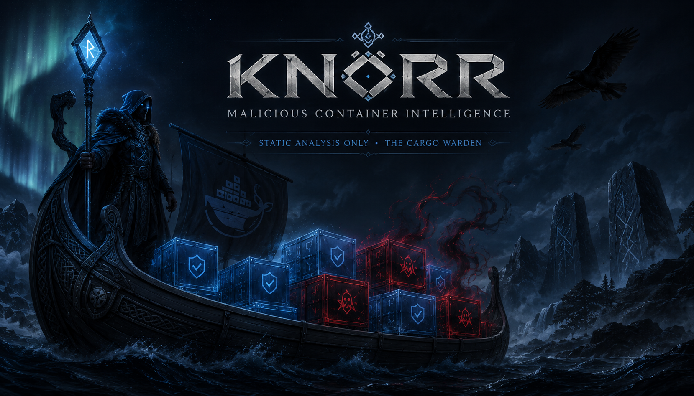
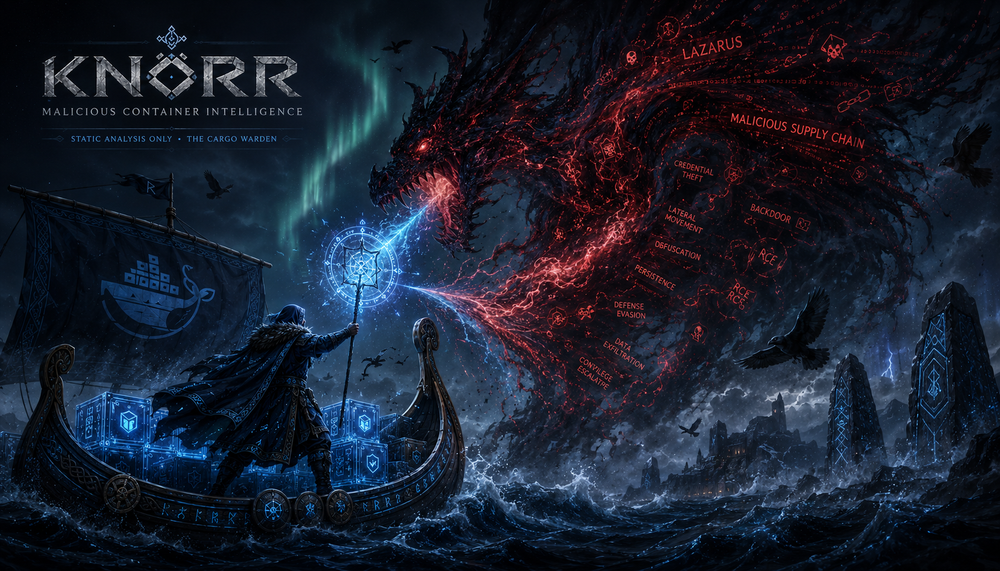
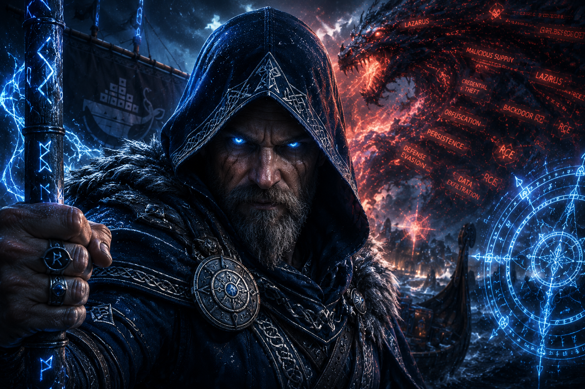

<div align="center">



# KNÖRR

*The warden of poisoned waters. The eye that does not sleep.*

[](https://www.python.org/) [](LICENSE)

</div>

---

## The Saga

In the age before memory, when the world-tree Yggdrasil stretched its roots into nine realms, the seas between them teemed with serpents wearing the faces of merchants. They sailed in vessels that looked like grain ships — but carried venom in the hold. Cryptojacking daemons. Reverse shells stitched into Alpine images. Typosquatted names so close to the true names that only a völva with clear-sight could tell them apart.

The gods grew weary of watching registries fill with rot.

So they sent **Knörr** — not a warrior, not a skald — a *knörr*. The merchant vessel that had sailed every route, learned every trick of the poisoned current, and now rode the dark registries with an eye like a hawk and a hull that drew no attention.

The captain asks no favors. He sails alone.

---

<div align="center">



</div>

---

## The Hunt

The waters Knörr patrols are vast.

**Docker Hub** churns with ten thousand images. Most are honest cargo. But threaded through them: **XMRig** dressed as `python:slim`, **kinsing** hiding in a Redis impersonation, **TeamTNT** campaign images with wallets baked into the manifest like runes carved in bone.

Knörr moves in three passes — none of them loud.

**The First Crossing — Discovery**
Knörr sweeps the surface with known words of power: miner families, coin names, campaign sigils. He circles proven-bad harbors and enumerates every vessel docked there. He checks the names of Official images against the names of their imitators — the typosquats — and marks those that are one rune off from truth.

**The Second Crossing — Tier-1 Screening**
No layer is pulled. No cargo opened. Knörr reads the manifest, reads the config. He scores the signals: baked-in pool addresses, stratum connections, environment variables carrying wallet strings, entrypoints that spawn shells in the dark. Confirmed malice needs no deeper look. It is logged, written to the wall, and the captain moves on.

**The Third Crossing — Tier-2 Reckoning**
For the leads that whisper but do not shout — the ones the manifest alone cannot condemn — Knörr pulls layers. He runs Trivy across the SBOM. He reads the strings. He finds what hides in the deep.

Nothing is ever executed. Nothing is assumed. The captain reads the runes and records what is true.

**The Reach Beyond the Sea**
Knörr sails not only the registry waters. He crosses into **GitHub** — hunting malicious Dockerfiles before they ever publish. The pre-publish surface, the build files, the poisoned source: he sees these too. A pipeline-only scanner never would.

**The Wall of Bad Owners**
When one vessel in an account is confirmed poison, the whole harbor is suspect. Knörr pivots on the owner — enumerates the fleet — and surfaces every image the bad actor ever docked. One confirmed miner becomes a full account audit.

---

<div align="center">



</div>

---

## What Knörr Carries

```
knorr probe <image>     — Tier-1 read of one image: manifest, config, signal score
knorr hunt              — Full sail: discover → screen → confirm → registry
```

The hold is light by design. The runtime needs only `requests`. Trivy is shelled out — never reimplemented. No pydantic. Runs clean on Python 3.14.

What comes out of the hold: **findings CSV**, **summary**, **SQLite ledger**. The captain records everything. Nothing goes to OSM without a human hand on the wheel.

---

*Knörr sailed before the gods named him. He will sail after.*

---

<p align="center">
  <a href="https://opensourcemalware.com/my-submissions">
    
  </a>
</p>

<div align="center">
<sub>OpenSource-For-Freedom · MIT License</sub>
</div>
